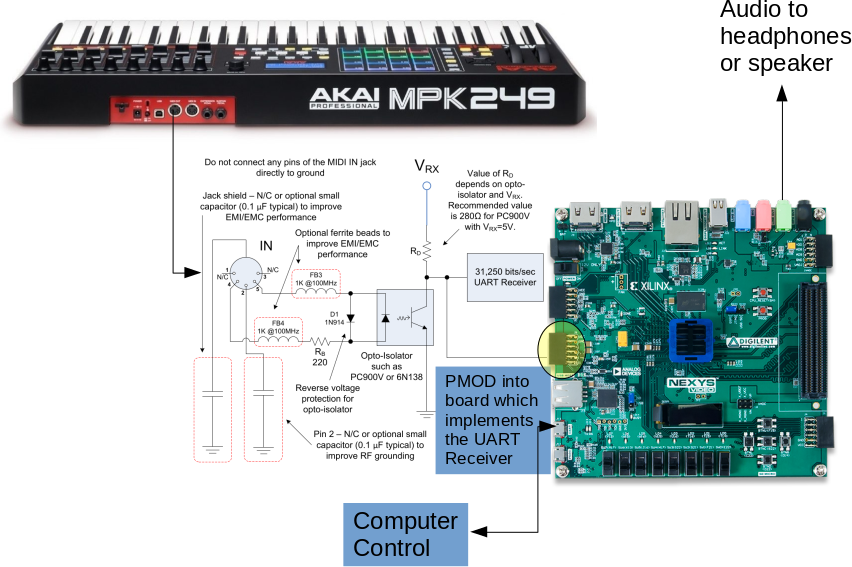
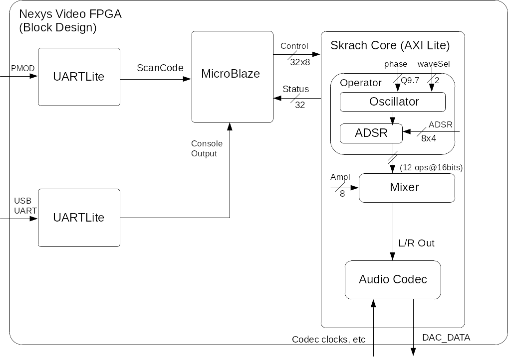

# Skrach - An FM Synthesizer
A final project plan for CE446 by Daria Solovey

April 8, 2020

[TOC]

## Proposal

### Need Statement

Quantum Fidelity, a tech startup, is looking to make a synthesizer module not dissimilar to classic systems such as the Moog, Yamaha DX7, and Korg synths. Except, in this case, instead of a built in keyboard, the system is controlled via MIDI protocol. The engineer in question is also musically inclined and would love to build an test this using his own equipment.

### Marketing Requirements

The basic requirements of the Skrach Synth are as follows:

- Generate signals such as a sine, triangle, square, and saw, outputting to the audio.
- Interface via MIDI protocol and 5 pin port with a MIDI device such as keyboard to receive signals.
- Modulate the pitch of the signals generated by the synth by the keys pressed on the midi keyboard.
- Debug info and control over UART.

Advanced requirements are as follows:

- Modify the characteristic of the signal via Frequency Modulation like the mentioned commercial synthesizers.
- Interface with the nobs, faders, and pads on the MIDI device to control the frequency modulation.
- Add filtration and effects to the generated signals to allow for even more sound characteristics.
- Use line in to accept a signal to modulate, similar to vocoder systems

Just unnecessary but cool and what I'd love to do functionality:

- Video output showing an interface that shows the state of Skrach, especially the shape of the signal being output through the system and levels and settings of the synth.
- MIDI Clock sync so that you can use multiple midi devices on the same synth.

### Level-0 Description

| Module   | Skrach Synth |
| -------- | ------------- |
| Inputs   | UART Control via serial |
|          | MIDI interface that implements MIDI protocol over 5 wire signal | to work with general purpose MIDI systems such as keyboards |
|          | Basic buttons/switches on the FPGA for basic setup and control |
|          | *ADV*: Audio input via Mic or Line In |
|          |  |
| Outputs  | Audio of the signal being generated on Line Out |
|          | Debug info on UART via serial |
|          | *Super*: Video showing state of the system and signal being generated|
|          | *Super*: MIDI Out for clock sync and other related settings/functions|
| | |
| Behavior | 1. Startup generates basic sine wave and output to audio. |
|          | 2. Use switches to change type of signal (sine, square, etc) |
|          | 3. MIDI signals from MIDI peripheral maps to certain functionality in Synth, namely keyboard keys to pitch of the signal |

*Note*: Module will need to be split into the relative modules, such as a function generator that generates clean signals, a frequency modulator that changes and combines signals, a UART communication module that interfaces with a MicroBlaze for control and debug, a video module to do video output.

## Detailed Architecture

### Level-1 Description

### Datapath and Control

The major control pieces are the UART control for user input, and also the MIDI control coming from a MIDI device which is also a form of user input.

Both feed into the MicroBlaze which will then control the synth module (datapath), modifying frequency, amplitude, and sound shape for output.

## Calculations

### MicroBlaze

For control, once scan codes are decoded, the phase should change depending on what key was pressed, meaning, similar to lab4, a popper frequency needs to be calculated and output as control to the synth module in the form of a Q10.6 phase value. Proper calculation for this will be investigated.

### Synth Module
Similar to lab4, the synth module will implement look up tables with phase to be able to change frequency. This will involve a Q10.6 phase signal to do step changes in indexing.

Once more is research on how to perform FM Synthesis, that too will be implemented using low frequency oscillators to modulate the carrier signal (main output). Calculation will be updated one I reach that point.

If possible, a filter system and or envelope will also be implemented that allows for control of the input in a fine grained control, were the volume of sound is defined by the envelope.

### MIDI Controller

The MIDI controller doesn't have much for calculation other than decoding the UART signal as it comes it. The signal is an 8 big scan code control signal signifying changes on the MIDI Device with a start and stop bit, meaning a total of 10 bits per key press. A state machine will have to be devised to read this properly and accurately. Either that, or an already available UART controller such as the UART Lite modified to work with the MIDI protocol.

## Technical Requirements

The basic technical requirements of this system is as follows:

- Ability to receive and properly decode MIDI signal allowing 88 keys of input as well as some basic modifiers like a fade wheel or pitch wheel.
- With MIDI input, allow for basic polyphony of input, meaning multiple inputs can be handled at once, but not necessarily in sound.
- Ability to print the status of the system over UART to a console as well as allow user input to control aspects of the synth module.
- Output a 16bit 48khz audio signal so that the system is a fairly high fidelity in terms of audio output.

## Bill of Materials

There are 3 major pieces to this project:

- Nexys Video FPGA [Already have it]
- MIDI Input Circuit (optocoupler, diode, MIDI connectors) [Ordered the circuit pieces. Resistors and breadboards, I already have]
- MIDI Controller such as a keyboard (AKAI MPK249) [Already have it]

## Milestone 1

It is required that MIDI decoding can be successfully completed. To test this, it would be easy to input a midi signal from the keyboard and see this output to console over UART, maybe printing from a table what key was pressed and released (e.g. A4 -> prints out A4 with the scan code).

## Milestone 2

Given the first milestone is reached, lab4 IP will be used and the MicroBlaze functionality repurposed to instead change phase with scan codes from MIDI controller. That means proper and acuate pitch is created with a basic sine wave on key press (e.g. A4 -> 440hz).

## Functionality

Required functionality will be MIDI controller decode with scan code input to MicroBlaze, and then pitch shifting to meet the correct frequency using lab 4 as the synth module. Amplitude control should also be implemented via a fade wheel or other interface on the MIDI controller. 

This can be easily tested by seeing scan codes decoded on the MicroBlaze over console, and an oscilloscope can show the frequency of the system when a key is pressed, which can be verified using known frequencies of keyboard keys.

### B-Level

B-Level functionality will consist of implementing higher level functionality of the Synth Module. This means implementing more oscillators (or signal types) to be able to have more sounds to choose from and also implementing a filter and or envelope system, building a foundation for FM Synthesis.

While not as easy to test, this can be done via oscilloscope showing how the signal changes with envelope/filter on or off, as well as audibly by hearing how the signal characteristic as it's changed. A virtual synth can also be used on computer to verify whether the filter/envelope sounds the same or creates the same waves as the hardware, being verified via oscilloscope.

### A-Level

A-Level functionality will consist of finishing the synth module to properly implement FM Modulation, meaning an operator will use multiple oscillators (a carrier and modulator) to create a unique and rich sound as output, similar to a Yamaha DX7.

Again, this is something difficult to test, but I have a virtual synth that can perform FM synthesis. The output of the virtual synth can be compared with the output of the hardware on an oscilloscope.