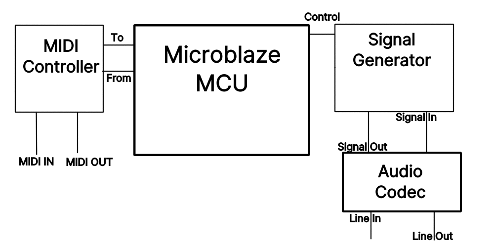

# Skrach - An FM Synthesizer
A final project proposal for CE446 by Daria Solovey

March 16, 2020

## Need Statement

Quantum Fidelity, a tech startup, is looking to make a synthesizer module not dissimilar to classic systems such as the Moog, Yamaha DX7, and Korg synths. Except, in this case, instead of a built in keyboard, the system is controlled via MIDI protocol.

## Marketing Requirements

The basic requirements of the Skrach Synth are as follows:
- Generate signals such as a sine, triangle, square, and saw, outputting to the audio.
- Interface via MIDI protocol and 5 pin port with a MIDI device such as keyboard to receive signals.
- Modulate the pitch of the signals generated by the synth by the keys pressed on the midi keyboard.
- Debug info and control over UART.

Advanced requirements are as follows:
- Modify the characteristic of the signal via Frequency Modulation like the mentioned commercial synthesizers.
- Interface with the nobs, faders, and pads on the MIDI device to control the frequency modulation.
- Add filtration and effects to the generated signals to allow for even more sound characteristics.
- Use line in to accept a signal to modulate, similar to vocoder systems

Just unnecessary but cool and what I'd love to do functionality:
- Video output showing an interface that shows the state of Skrach, especially the shape of the signal being output through the system and levels and settings of the synth.
- MIDI Clock sync so that you can use multiple midi devices on the same synth.

## Level-0 Description

| Module   | Skrach Synth |
| -------- | ------------- |
| Inputs   | UART Control via serial |
|          | MIDI interface that implements MIDI protocol over 5 wire signal | to work with general purpose MIDI systems such as keyboards |
|          | Basic buttons/switches on the FPGA for basic setup and control |
|          | *ADV*: Audio input via Mic or Line In |
|          |  |
| Outputs  | Audio of the signal being generated on Line Out |
|          | Debug info on UART via serial |
|          | *Super*: Video showing state of the system and signal being generated|
|          | *Super*: MIDI Out for clock sync and other related settings/functions|
| | |
| Behavior | 1. Startup generates basic sine wave and output to audio. |
|          | 2. Use switches to change type of signal (sine, square, etc) |
|          | 3. MIDI signals from MIDI peripheral maps to certain functionality in Synth, namely keyboard keys to pitch of the signal |

*Note: Module will need to be split into the relative modules, such as a function generator that generates clean signals, a frequency modulator that changes and combines signals, a UART communication module that interfaces with a Microblaze for control and debug, a video module to do video output.